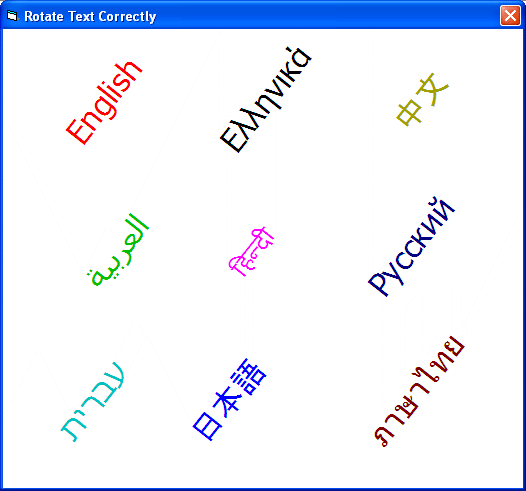

<div align="center">

## Rotate Text Correctly


</div>

### Description

This example of code shows how to rotate the text correctly, the CreateFont function rotates the text around the text starting point, this code demonstrates rotating text around the text center point using CreateFont function and correcting the point to print the text and rotate
 
### More Info
 


<span>             |<span>
---                |---
**Submitted On**   |2010-04-22 19:15:54
**By**             |[Saed abumokh](https://github.com/Planet-Source-Code/PSCIndex/blob/master/ByAuthor/saed-abumokh.md)
**Level**          |Advanced
**User Rating**    |5.0 (25 globes from 5 users)
**Compatibility**  |VB 6\.0
**Category**       |[Graphics](https://github.com/Planet-Source-Code/PSCIndex/blob/master/ByCategory/graphics__1-46.md)
**World**          |[Visual Basic](https://github.com/Planet-Source-Code/PSCIndex/blob/master/ByWorld/visual-basic.md)
**Archive File**   |[Rotate\_Tex2179574232010\.zip](https://github.com/Planet-Source-Code/saed-abumokh-rotate-text-correctly__1-73090/archive/master.zip)

### API Declarations

```
TextOut,GetTextAlign,GetTextColor,SetTextAlign,SetTextColor,MulDiv,
GetDeviceCaps,GetTextExtentPoint32,CreateFont,SelectObject,DeleteObject.
```


